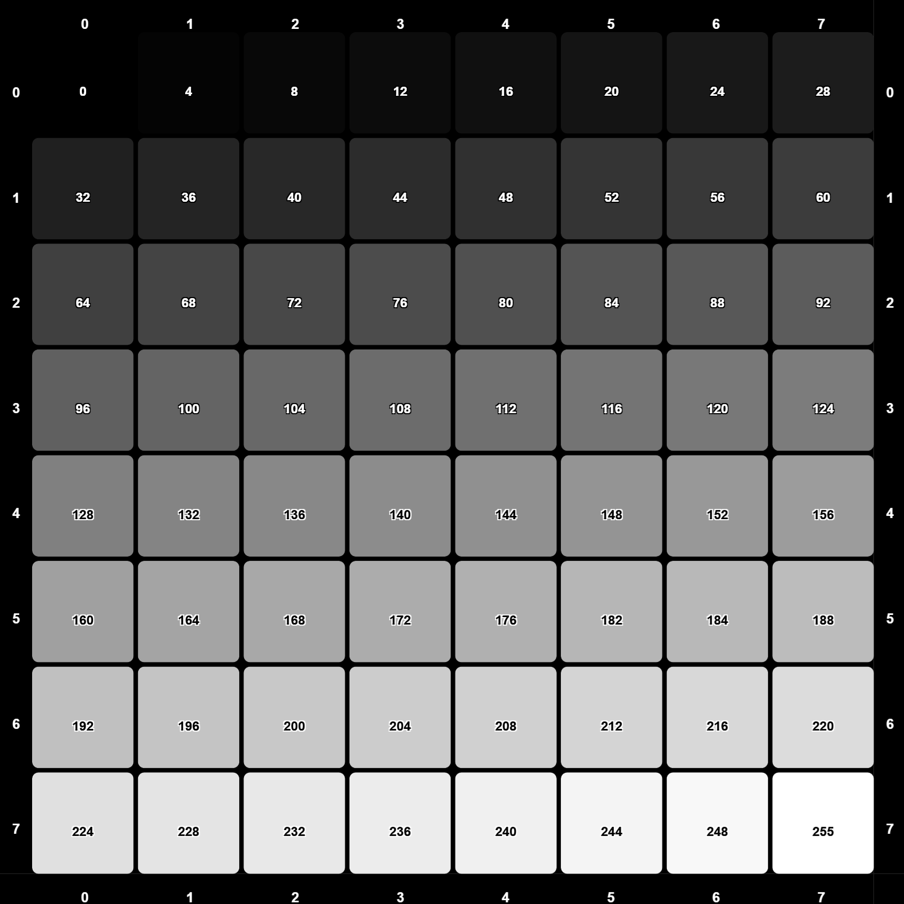
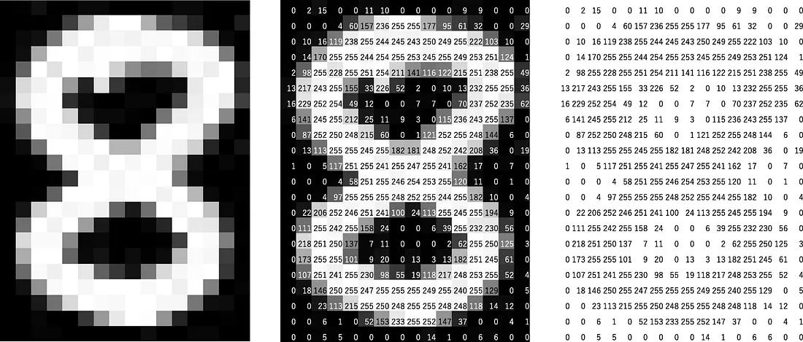

# **Apresentação**
Olá! Meu nome é **[Vinícius Fonseca](https://www.linkedin.com/in/vinicius-silva-fonseca/)** e sou estudante de graduação em **Matemática** na **[UEL - Universidade Estadual de Londrina](https://portal.uel.br/conheca-a-uel/)**.  

Desde o meu primeiro "Hello World!" me apaixonei por programação — e desde então, não parei mais.  

Naturalmente, a proximidade entre Matemática e Ciência de Dados me levou a aprender ``Python`` e, com ele, as principais bibliotecas da área:

  - `NumPy`
  - `Pandas`
  - `matplotlib`
  - `OpenCV`
  - `YOLO`

As três primeiras foram fundamentais no desenvolvimento do meu projeto ***Uso de LLMs para Detecção de Fake News no Brasil***, no qual utilizei LLMs para gerar embeddings com o Ollama e os classifiquei com um Random Forest Classifier do `scikit-learn`, alcançando métricas ***f1-macro*** entre ***88%*** (pior cenário) e ***99%*** (cenário ideal).

>Confira o projeto aqui **→** [LLM4FakeNews](https://github.com/Viniks07/LLM4FakeNews)   

Embora esse projeto tenha trazido importantes aprendizados, meu principal interesse sempre foi a área de **Visão Computacional**.  

Ao experimentar diversos exemplos com `OpenCV` e `YOLO`, percebi que estava adquirindo familiaridade com as bibliotecas, mas sentia falta de uma compreensão mais aprofundada dos princípios que fundamentam seu funcionamento.

Com esse pensamento, decidi iniciar este novo projeto chamado [MovRecCNN](https://github.com/Viniks07/MovRecCNN):
  
 **Desenvolver um pipeline de detecção e reconhecimento de movimentos sem uso de bibliotecas externas, utilizando apenas:**

- Bibliotecas nativas do ``Python``

- ``numpy`` para manipulação de matrizes

- ``OpenCV`` ***será utilizado exclusivamente para leitura e escrita de vídeos e imagens***

E por falar em matrizes, está na hora de abordarmos o elemento central de todo este projeto.

# **A Matriz**

A matriz é uma das principais representações de imagem digitalmente e nós abordaremos sua estrutura

### **Resolução**

Na matriz — como representação de imagem — o numero e disposição de pixel define a **resolução** da imagem por exemplo imagens *full HD* corresponde a **${1920\times1080}$**.  

Normalmente quando trabalhamos com imagens a primeira dimensão costuma indicar o numero de colunas **${(1920)}$** e a segunda o numero de linhas **${(1080)}$**. No entanto no contexto da algebra — que é o nosso —  a primeira dimensão sera o numero de linhas e a segunda o numero de colunas portanto seu formato seria **${(1080\times1920)}$**.   
( ***Mantenha isso em mente para evitar confusões*** )

Assim a matriz **${m \times n}$** gera a resolução.

### **Canais**

Vamos restringir nosso foco a apenas **dois tipos** tipos as matrizes que possuem 1 canal e as que possuem 3 canais

#### **Escala de cinza**
A matriz com apenas 1 canal produz uma imagem em escala de cinza onde cada $P_{mn}$ é um numero de **0** a **255** (***1 byte***).
Sendo **0** o mais proximo do **preto** e **255** o mais o proximo de **branco**  

A imagem abaixo representa uma matriz em escala de cinza mas pode nos mostrar conceitualmente como funciona o posicionamento de cada pixel e os valores dentro deles de ambos os tipos de matrizes.

  

abaixo uma matriz **${8\times8}$** com algumas gradações da escala de cinza

Abaixo temos um exemplo mais "realista" de uma imagem em escala de cinza 

## -------------------------------------------------------

[**Veja como funciona aqui**](https://viniks07.github.io/MovRecCNN/media/html/simulador_de_pixel.html)
