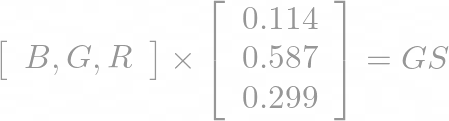
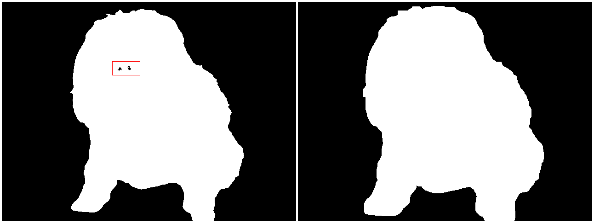

# Sumário  

1.  **[Apresentação](#apresentação)**
2.  **[A Matriz](#a-matriz)**
3.  **[Pré-Processamento](#pré-processamento)**  

# **Apresentação**
Olá! Meu nome é **[Vinícius Fonseca](https://www.linkedin.com/in/vinicius-silva-fonseca/)** e sou estudante de graduação em **Matemática** na **[UEL - Universidade Estadual de Londrina](https://portal.uel.br/conheca-a-uel/)**.  

Sempre gostei de matemática, mas foi com a programação que percebi uma matemática além dos livros — uma que pode sair do papel e se tornar algo concreto. E o que mais me encantou foi justamente isso: transformar pensamentos e ideias em soluções reais.

Naturalmente, a proximidade entre Matemática e Ciência de Dados me levou a aprender ``Python`` e, com ele, as principais bibliotecas da área:

  - `NumPy`
  - `Pandas`
  - `matplotlib`
  - `OpenCV`
  - `YOLO`

As três primeiras foram fundamentais no desenvolvimento do meu projeto ***Uso de LLMs para Detecção de Fake News no Brasil***, no qual utilizei LLMs para gerar embeddings com o Ollama e os classifiquei com um Random Forest Classifier do `scikit-learn`, alcançando métricas **f**1**-macro**  entre ***88%*** (pior cenário) e ***99%*** (cenário ideal).

>Confira o projeto aqui **→** [LLM4FakeNews](https://github.com/Viniks07/LLM4FakeNews)   

Embora esse projeto tenha trazido grandes aprendizados, meu principal interesse sempre foi a área de **Visão Computacional**.  

Ao experimentar alguns pequenos projetos com `OpenCV` e `YOLO`, percebi que estava adquirindo familiaridade com as bibliotecas, mas sentia falta de uma compreensão mais aprofundada dos princípios que fundamentam seu funcionamento.

Com esse pensamento, decidi iniciar este novo projeto chamado [MovRecCNN](https://github.com/Viniks07/MovRecCNN) que consiste em:
  
 **Desenvolver um pipeline de detecção e reconhecimento de movimentos sem uso de bibliotecas externas, utilizando apenas:**

- Bibliotecas nativas do ``Python``

- ``NumPy`` para manipulação de matrizes

- ``OpenCV`` ***será utilizado exclusivamente para testes, leitura e escrita de vídeos e imagens.***

E por falar em matrizes, está na hora de abordarmos o elemento central de todo este projeto.

# **A Matriz**

A matriz é uma das principais formas de representar uma imagem digitalmente, vamos abordar abaixo sua estrutura.

### **Resolução**

Na matriz — como representação de imagem — o numero e disposição de pixel define a **resolução** da imagem. Por exemplo, imagens *Full HD* correspondem a  $\mathbf{1920\times1080}$.  

Normalmente quando trabalhamos com imagens a primeira dimensão
costuma indicar o numero de colunas $\mathbf{(1920)}$ e a segunda
o numero de linhas $\mathbf{(1080)}$. Porém, quando tratamos do
ponto de vista algébrico — que é o nosso caso — a primeira
dimensão será o número de linhas, e a segunda, o número de
colunas, portanto, seu formato seria $\mathbf{(1080 \times 1920)}$ — ( ***Mantenha isso em mente para evitar confusões*** ).

Portanto a resolução é definida pela matriz ${m \times n}$, sendo ${m}$ o numero de linhas e ${n}$ o numero de colunas.

### **Canais**

Vamos restringir nosso foco a **dois tipos** de matrizes: as que possuem **1 canal** e as que possuem **3 canais**.

#### **Escala de cinza**
A matriz com apenas **1 canal** produz uma imagem em **escala de cinza** onde cada elemento $p_{ m, n}$ é um número de **0** a **255** (***1 byte***).
Sendo **0** o mais proximo do **preto** e **255** o mais o proximo de **branco**  

A imagem abaixo representa uma matriz em escala de cinza mas pode nos mostrar conceitualmente como funciona o posicionamento de cada **pixel** e os valores dentro deles de ambos os tipos de matrizes.

  

Abaixo temos um exemplo de como isso funciona em escala de cinza 

#### **RGB**
A matriz **RGB** é uma matriz tridimensional 
(***[Tensor](https://medium.com/@michel.macario/sem-tensores-n%C3%A3o-h%C3%A1-intelig%C3%AAncia-artificial-62cae98b7e88)***) composta por **3 canais** de cores onde cada elemento $p_{m, n, c}$ é a representação de cada uma dessas cores **RGB** — (***Vermelho***, ***Verde***, ***Azul***) — e vai de **0** a **255**  
(**3 canais** de ***1 byte*** cada; Logo, cada pixel ocupa ***3 bytes***)  

Podemos pensar essa matriz tridimensional como um conjunto de matrizes bidimensionais **empilhadas** como mostra a figura.  

  

Outra maneira de pensarmos essa matriz RGB é imaginar uma matriz bidimensional onde cada elemento $p_{m, n}$ são triplas **[R , G , B]** que definem a cor daquele pixel como mostra a figura e a imagem completa é uma matriz $IM_{(m \times n \times 3)}$.  

>Caso queira ver de maneira interativa como pode ser pensado esses tipos de [pixel](https://viniks07.github.io/MovRecCNN/media/html/simulador_de_pixel.html).

Compreender a estrutura matricial será fundamental para o entendimento deste projeto especialmente em **processamento de imagens** e **aprendizado de máquina**. A matriz não é apenas uma forma de organizar os pixels, mas sim a estrutura que possibilita manipulações, análises e transformações visuais. Agora que entendemos como uma imagem pode ser representada por uma matriz — seja em escala de cinza ou em cores RGB —, estamos prontos para explorar como operar sobre esses dados e extrair informações úteis a partir deles.

# **Pré-Processamento**

Após uma breve explicação sobre matrizes, entraremos de fato na primeira etapa do projeto: o pré-processamento. Nesta fase, veremos código de fato e exploraremos as funções que foram criadas e implementadas por mim. Para isso, utilizaremos a melhor biblioteca do `Python` — na minha opinião, é claro  — o **`NumPy`**.  

Todas essas funções foram criadas para auxiliar o processo e todas se encontram no modulo **[data_processing.py](https://github.com/Viniks07/MovRecCNN/blob/main/src/data_processing.py)**

Essa é a Nina e ela vai nos ajudar a demonstrar o efeito das funções nas imagens  

## Mirroring

A primeira função criada foi a de espelhamento, pois estamos acostumados a nos ver no espelho — e por isso, quando vemos uma imagem espelhada, nos parece mais natural. Essa função é importante para ajustar imagens que, de outra forma, poderiam parecer “ao contrário” ou invertidas.

## Gray Scale

A segunda função multiplica o vetor de canais de cor por uma matriz (*vetor-coluna*) de pesos padronizada(***NTSC***). Pelas propriedades da multiplicação matricial, o resultado é um escalar que corresponde ao valor em escala de cinza.

Matematicamente:

  

onde $GS$ — um número decimal que é convertido para um inteiro — representa o tom de cinza — *Apesar da matriz ser **RGB** o `OpenCv` lê as matrizes como **BGR** por isso invertemos os **canais de cor** e a matriz **NTSC***

## Background Subtraction

A remoção do fundo foi, sem dúvida, o maior desafio desta etapa do projeto. Embora estejamos demonstrando as funções com imagens estáticas, o objetivo final é trabalhar com vídeos, o que exige uma técnica que possa remover o fundo de forma dinâmica.

A primeira abordagem que implementei foi um método de **``Chroma Key``**, que removia a cor de fundo dinamicamente, baseando-se no **desvio padrão de um valor RGB** capturado dentro de uma região delimitada por outra função chamada ``Target``. Essa função analisava todos os pixels contidos dentro do quadrado gerado para definir a cor a ser excluída.

Apesar de ser uma solução criativa, essa abordagem apresentava uma limitação significativa: ela dependia de um fundo de cor sólida e em um espectro de cores bastante específico, o que restringia seu uso.

Depois de pesquisar, encontrei uma alternativa que atendeu muito melhor ao propósito: a técnica de ``Background Subtraction``.

A ideia é simples, mas eficaz:

1. Assume-se um **fundo estático**.

2. Um **frame vazio** (sem o objeto de interesse) é capturado como referência.

3. A partir desse frame de referência, um **limiar** é definido. Qualquer pixel nos frames subsequentes que tenha **variação menor** que esse limiar em comparação com o frame de referência é considerado parte do fundo e é "**apagado**".

Dessa forma, quando o fundo é igual ao frame de referência, a tela permanece preta. Mas assim que um objeto entra em cena, seus pixels diferem do frame de referência, fazendo com que o objeto se destaque na imagem. Essa abordagem provou ser muito mais robusta para a detecção de movimento em vídeos.

## Binarization

Após a remoção do fundo, a imagem é **binarizada** — *objeto vs. fundo*.

- Todos os pixels pertencentes ao fundo permanecem **preto** (**0**).

- O objeto destacado recebe um valor de contraste **máximo**, normalmente **branco** (**255**).

Essa binarização facilita os proximos passos — como segmentação, contorno e detecção de movimento.

## Dilate

Normalmente, após a binarização, a imagem destacada pode apresentar "**buracos**" — como, coincidentemente, aconteceu na imagem de referência — então aplicamos [Morfologia Matemática (***Dilatação***)](https://www.youtube.com/watch?v=E8cqrkK4L_M&list=PLLFpILRpgx7lJlHOl3TXGuUVWnqzgTITh&index=13) para preenchê-los.

## Down Sampling

O downsampling foi o segundo grande desafio desta parte do projeto. Apesar de todos os processos de pré-processamento, não é viável usar a imagem completa como input do modelo. Pense na resolução que usamos aqui, de ($480 \times 640$), que corresponde a aproximadamente $\textbf{307}$ **mil pixels**!  
Processar tantos dados seria ineficiente e pesado.

É exatamente por isso que implementei a função ``Down Sampling``. Ela é responsável por diminuir a resolução da imagem. Basicamente, a função cria uma nova matriz em branco, cujo shape (***dimensões***) é o da imagem original dividido por um valor ``division``.

Em seguida, ela percorre a imagem original usando uma "**janela**" (***matriz quadrada***) com o tamanho definido por ``division``. Para cada uma dessas janelas, a função calcula a média dos valores dos pixels contidos nela. Esse valor médio é então usado para preencher o pixel correspondente na matriz de amostra reduzida.

Dessa forma, conseguimos uma representação menor da imagem, mantendo as informações essenciais, mas com um volume de dados muito mais adequado para as próximas etapas do projeto.

*Ex:* $\ 480 \times 640\ (307\ mil\ pixels)  →  \ 30\times40\ (1200 \ pixels)$  
( $\mathbf{256x}$ **menor  que  a imgem original** )

A função pode ser usada em ambos os formatos:

- Cinza

 

- RGB 

 

<b>*Reiterando</b> : <i>As referencias a direita não são os resultados reais eles são apenas representações(***visualizer***). As imagens reais são menores — $ \mathbf{256x}$ **menor como já foi dito** — comparadas a imagem **não** ***"Down Sampleada"***

## Bounding Box

A ``Bounding Box`` é um retângulo que delimita o objeto de interesse em uma imagem, sendo usada para identificá-lo e localizar sua posição.

A função implementada identifica o objeto com base em uma imagem binarizada: ela procura as colunas e linhas onde o objeto aparece (ou seja, onde os pixels são diferentes de zero) e utiliza essas posições para construir os quatro lados do retângulo.

Essa caixa delimitadora é retornada e os vertices são marcados, pois serão necessários futuramente. Dessa forma, a imagem binarizada serve como um mapa espacial da posição do objeto na imagem original.

E para imagens em movimento — **Vídeo** e **.gif**:

Chegou o momento de nos despedirmos da Nina — ela foi essencial até aqui, mas a próxima função pede um pouco mais de movimento.

Antes de avançarmos, vamos rever o processo pelo qual cada frame passou. Isso nos ajudará a entender como chegamos ao resultado final.

## Centralize

Chegamos agora à nossa última função de pré-processamento. A função ``Centralize`` tem como objetivo **manter o objeto centralizado horizontalmente** na imagem.

Mas por que isso é necessário?

Nosso objetivo é que o modelo aprenda a **reconhecer gestos**, e **não a posição do objeto na imagem**. Se não centralizarmos, o modelo pode acabar associando uma determinada posição à classe, e não ao gesto em si. Por exemplo, se uma pose for sempre feita no lado direito da imagem, o modelo poderá interpretar a **posição**, e não o **formato da pose**, como critério de classificação.

O processo da função ``Centralize`` segue os seguintes passos:

- Recorta o objeto com base nos vértices obtidos pela função ``Bounding Box``.

- Calcula o **centro de massa horizontal** do objeto (*com base nos pixels brancos*).

- **Centraliza** o objeto horizontalmente na imagem com base no centro de massa.

- Aplica **padding com pixels nulos** (*preto*) para que a imagem final mantenha o mesmo tamanho da original.

Assim, garantimos que o modelo aprenda somente as poses e não use a posição do objeto como fator decisivo.

# Data Set

[**WORK WORK  . . .**](https://www.youtube.com/watch?v=eO6OaVnbqaY)
